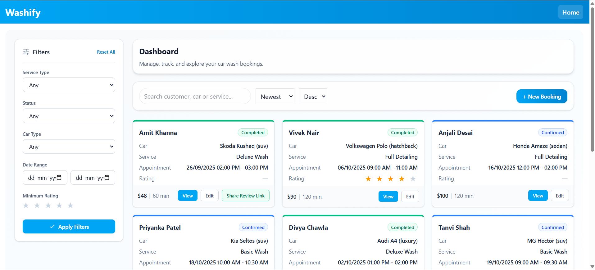
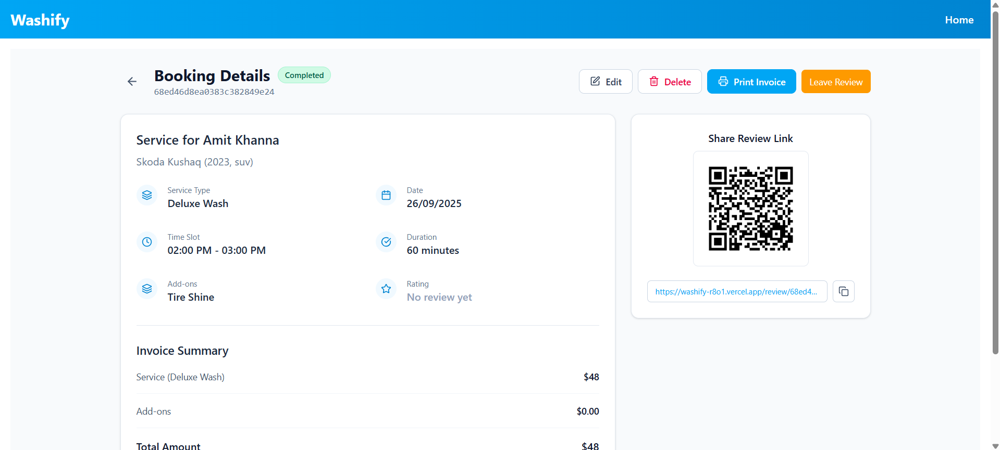
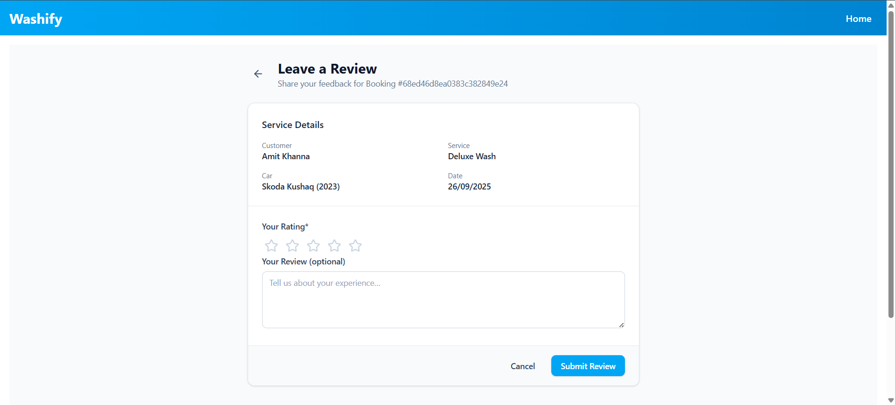
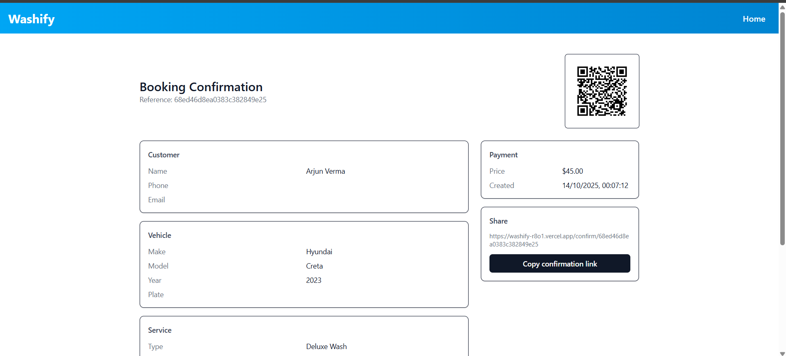

# Washify - Car Wash Booking Management

Washify is a full-stack web application built with the MERN (MongoDB, Express, React, Node.js) stack. It provides a simple and intuitive interface for managing car wash bookings. Users can create, view, update, delete, search, and filter bookings seamlessly.
This project was developed as a MERN stack assessment, focusing on core CRUD functionalities, RESTful API design, and a clean user experience.

## Features

### Core Functionality
- **CRUD Operations:** Full capabilities to Create, Read, Update, and Delete car wash bookings.
- **View All Bookings:** The homepage displays all bookings in a responsive card layout with pagination (8–10 bookings per page).
- **Detailed Booking View:** Each booking has a dedicated page showing all its details.
- **Create & Edit Bookings:** User-friendly forms for adding new bookings and editing existing ones. The edit form comes pre-populated with the existing data.
- **Delete Confirmation:** A confirmation modal appears before deleting a booking to prevent accidental data loss.

### Search and Filtering
- **Real-time Search:** Instantly search for bookings by Customer Name or Car Details (Make, Model).
- **Advanced Filtering:** Filter bookings based on multiple criteria:
  - Service Type (e.g., Basic Wash, Deluxe Wash)
  - Car Type (e.g., Sedan, SUV)
  - Booking Status (e.g., Pending, Confirmed, Completed)
  - Date Range

### User Experience
- **Responsive Design:** The UI is fully responsive and optimized for both desktop and mobile devices.
- **Loading & Error States:** Clear loading indicators and error messages are displayed during API calls to provide feedback to the user.
- **Clean & Modern UI:** A simple and intuitive interface for a smooth user experience.

## Tech Stack

### Frontend
- **React:** A JavaScript library for building user interfaces.
- **React Router:** For client-side routing and navigation.
- **Axios:** For making HTTP requests to the backend API.
- **Tailwind CSS:** For modern and responsive styling.

### Backend
- **Node.js:** A JavaScript runtime for the server.
- **Express.js:** A web application framework for Node.js.
- **CORS:** Middleware for enabling Cross-Origin Resource Sharing.
- **Morgan:** Middleware for logging HTTP requests.

### Database
- **MongoDB:** A NoSQL database for storing booking information.
- **Mongoose:** An Object Data Modeling (ODM) library for MongoDB and Node.js.

## Live Links
- **Frontend Deployed Link:** [ https://washify-r8o1.vercel.app/]( https://washify-r8o1.vercel.app/)

## Project Structure

```
Washify/
├── backend/
│   ├── config/
│   │   └── db.js          # Database connection configuration
│   ├── controllers/
│   │   └── bookingsController.js # Booking logic
│   ├── middlewares/
│   │   └── errorHandler.js # Error handling middleware
│   │   └── validate.js     # Validation middleware
│   ├── models/
│   │   └── Booking.model.js  # Booking model
│   ├── routes/
│   │   └── bookings.js      # Booking routes
│   ├── utils/
│   │   └── buildQuery.js    # Utility functions for building queries
│   ├── index.js             # Main backend entry point
│   └── package.json
├── frontend/
│   ├── src/
│   │   ├── api/
│   │   │   └── axios.js       # Axios instance
│   │   ├── components/
│   │   │   └── AddOnsSelector.jsx # Add-ons selector component
│   │   │   └── BookingCard.jsx    # Booking card component
│   │   │   └── BookingConfirm.jsx # Booking confirmation component
│   │   │   └── BookingReview.jsx  # Booking review component
│   │   │   └── FilterSidebar.jsx  # Filter sidebar component
│   │   │   └── Pagination.jsx     # Pagination component
│   │   │   └── RatingStars.jsx    # Rating stars component
│   │   │   └── SearchBar.jsx      # Search bar component
│   │   │   └── SortBar.jsx        # Sort bar component
│   │   ├── pages/
│   │   │   └── BookingDetail.jsx  # Booking detail page
│   │   │   └── BookingForm.jsx    # Booking form page
│   │   │   └── Home.jsx           # Home page
│   │   ├── App.jsx              # Main application component
│   │   ├── main.jsx             # Main frontend entry point
│   │   └── index.css            # Global styles
│   ├── vite.config.js         # Vite configuration
│   └── package.json
├── .gitignore
└── README.md
```

## 📸 Screenshots





## Local Setup
- Follow these instructions to get the project running on your local machine.

### Prerequisites

- Node.js 18.0 or later
- npm or yarn
- MongoDB (local installation or a MongoDB Atlas URI)

## Running the App Locally

To run it on your local machine, follow these steps:

1. **Clone the repository**:
   Make sure you have **Git** installed. Run the following command:

   ```sh
   git clone https://github.com/Kritika745/Washify.git
   cd Washify
   ```

2. **Backend setup**:
   ```sh
   cd backend
   npm install
   ```
    Create a .env file in the backend folder with the following content:
   ```sh
   PORT=5000
   MONGODB_URI=<your-mongodb-connection-string>
   CORS_ORIGIN=http://localhost:5173

   ```
   Start the backend server:
   ```sh
   npm run dev
   ```


3. **Frontend setup**:
   ```sh
   cd frontend
   npm install
   ```
    Create a .env file in the frontend folder with the following content:
   ```sh
   VITE_API_BASE_URL=http://localhost:5000/api
   ```
   Start the frontend:
   ```sh
   npm run dev
   ```

   

